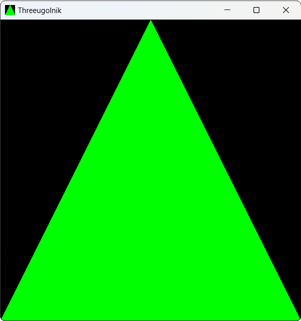

# Лабораторная работа № 10. Зелёный треугольник
## Задание
В ходе этой лабораторной необходимо реализовать отрисовку зелёного треугольника на чёрном фоне с помощью OpenGL/WebGL и шейдеров.

## Демонстрация работы

